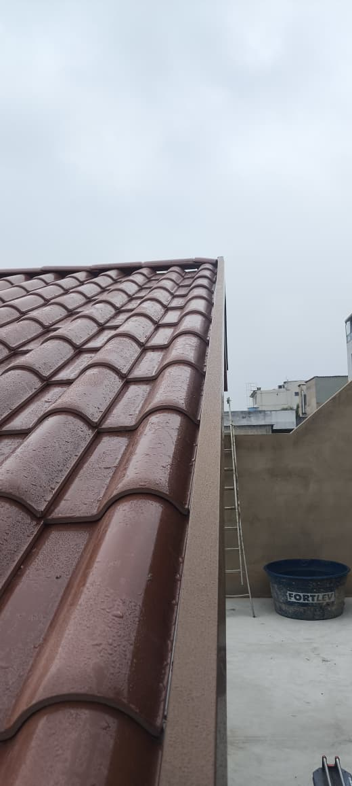

# HD Calhas

Site institucional da **HD Calhas**, empresa especializada em fabricacao e instalacao de calhas, rufos, condutores, pingadeiras e acabamentos de telha no Espirito Santo.

O projeto foi desenvolvido como uma pagina estatica, leve e responsiva, com foco em apresentacao dos servicos, portfolio visual, videos de execucao, chamada para orcamento via WhatsApp e informacoes de contato.

## Visao Geral

- Pagina inicial com hero visual e chamada para orcamento.
- Secao de servicos com cards individuais.
- Galeria de obras com lightbox para ampliar imagens.
- Secao "Sobre nos" contando a trajetoria da empresa.
- Area de videos dos servicos.
- CTA para WhatsApp.
- Rodape com navegacao, contato, Instagram e mapa.
- SEO basico com meta tags, Open Graph, Twitter Card e JSON-LD.

## Tecnologias

- **HTML5**
- **CSS3**
- **JavaScript puro**
- Layout responsivo sem dependencias externas obrigatorias.

## Estrutura do Projeto

```text
hdcalhas/
|-- index.html
|-- style.css
|-- main.js
|-- LICENSE
|-- imagens/
|   |-- logo.png
|   |-- hero.png
|   |-- boneco3D.jpeg
|   `-- imagens dos servicos e obras
`-- videos/
    `-- videos dos servicos
```

## Como Rodar Localmente

Como o site e estatico, voce pode abrir o `index.html` direto no navegador.

Para uma visualizacao melhor durante o desenvolvimento, use uma extensao como **Live Server** no VS Code ou rode um servidor local:

```bash
python -m http.server 5500
```

Depois acesse:

```text
http://127.0.0.1:5500
```

## Principais Arquivos

### `index.html`

Contem toda a estrutura da pagina:

- Cabecalho e menu.
- Hero.
- Servicos.
- Obras realizadas.
- Sobre.
- Videos.
- CTA.
- Rodape.
- Lightbox da galeria.

### `style.css`

Controla todo o visual do site:

- Cores.
- Responsividade.
- Grid dos servicos e obras.
- Estilo dos videos.
- Rodape.
- Menu mobile.
- Animacoes de entrada.

### `main.js`

Responsavel pelas interacoes:

- Menu hamburguer no mobile.
- Animacao de elementos ao rolar a pagina.
- Header com efeito ao scroll.
- Lightbox da galeria.
- Link ativo no menu conforme a secao visivel.

## Como Alterar Imagens

As imagens ficam na pasta:

```text
imagens/
```

Para trocar uma imagem, substitua o arquivo na pasta ou altere o caminho no `index.html`.

Exemplo:

```html

```

Sempre que trocar uma imagem, ajuste tambem o texto do `alt` para descrever corretamente o que aparece nela.

## Como Alterar Videos

Os videos ficam na pasta:

```text
videos/
```

No `index.html`, a secao de videos usa a tag:

```html
<video src="videos/nome-do-video.mp4" controls preload="metadata" playsinline></video>
```

Para trocar, coloque o novo arquivo na pasta `videos/` e atualize o `src`.

## Contato e Redes

Os links de WhatsApp, Instagram e endereco ficam no `index.html`.

Pontos principais:

- WhatsApp: `https://wa.me/5527997215812`
- Instagram: `https://instagram.com/hd_calhaas`
- Mapa: iframe do Google Maps no rodape

## SEO

O projeto ja possui:

- `title`
- `meta description`
- `meta keywords`
- Open Graph
- Twitter Card
- JSON-LD com dados locais da empresa

Caso mude telefone, endereco, nome ou descricao da empresa, atualize tambem essas informacoes no bloco inicial do `index.html`.

## Licenca

Este projeto esta sob a licenca MIT. Veja o arquivo [LICENSE](LICENSE) para mais detalhes.
